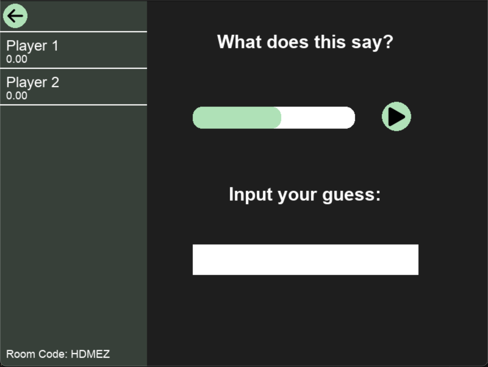

# BrainLabel

---

## Project Overview
"Invisible Humans" are underpaid workers in global south countries who are used to label data to be used in training AI models. At Hackers Without Borders 2026, my team members and I sought to find a more humane method to get labeled data. 
Introducing BrainLabel, a game that turns exploitative data labeling jobs into fun with friends.